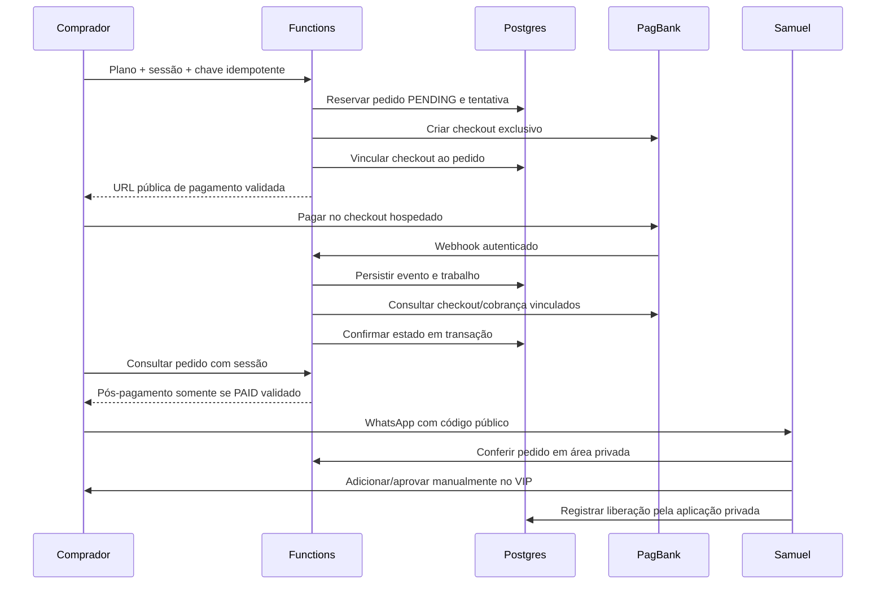

# Arquitetura de pagamentos Nour — Prompt 4

> Atualização do Prompt 5: criação Sandbox, adaptador SQL, sessão e proteção contra abuso foram implementados. O estado vigente dessa etapa está em [checkout-sandbox.md](checkout-sandbox.md). As descrições de rotas bloqueadas e ausência de dependências abaixo registram o estado histórico do Prompt 4; webhook e consulta financeira continuam bloqueados.

Decisão registrada em 16/09/2026. Preparação local; nenhuma conta, credencial, banco remoto, checkout ou publicação foi criado. Fontes externas consultadas: somente documentação oficial do PagBank e da Netlify.

## Estado encontrado antes das alterações

Landing nativa em `dist/`, três CSS, `motion.js` e marca local. Planos exibidos: mensal R$ 100, semestral R$ 500, anual R$ 800. Compras e WhatsApp desativados; CTA geral aponta a `#planos`. Não havia Functions, banco, dependências npm ou integração. Git estava limpo. A configuração local `.openai/hosting.json` apenas aponta a `dist/`; foi preservada, sem uso para publicação. Os arquivos públicos permanecem idênticos.

## Escolha e limite desta entrega

Netlify Functions em JavaScript, Checkout hospedado do PagBank e Netlify Database/Postgres. O banco é adequado para transações, unicidade e concorrência. Está disponível no Free **baseado em créditos**, sujeito à franquia e aos limites. Não foi verificado o plano da conta do cliente. A documentação ainda menciona gratuidade de armazenamento até 01/07/2026, data passada: não presumir gratuidade atual ou custo zero. Conferir condições no painel antes de provisionar. Não usar memória, `/tmp`, arquivos das Functions ou Blobs como banco de pedidos. [Database](https://docs.netlify.com/build/data-and-storage/netlify-database/), [limites e cobrança](https://docs.netlify.com/build/data-and-storage/netlify-database/billing-and-usage/).

Preparado: configuração `publish = dist`, três rotas bloqueadas, política de domínio testável, verificador isolado Order/Charge, migração SQL e contratos abaixo. **Ainda não implementado:** adaptadores HTTP/SQL, sessões, limitação de requisições, processamento de eventos, worker, área privada do Samuel e tela pós-pagamento. Todas as rotas retornam 503 no método esperado; nenhuma variável desbloqueia este código. Não confundir a estrutura com uma integração funcional.

O futuro adaptador usará `getDatabase()` de `@netlify/database`, consultas parametrizadas e `pool.connect()` para transações na mesma conexão. A dependência será instalada e fixada na etapa de integração; não há SDK ou dependência externa nesta etapa. [API do Database](https://docs.netlify.com/build/data-and-storage/netlify-database/api/).

## Fluxo de confiança

O redirecionamento do PagBank, query string, screenshot, comprovante e mensagem do WhatsApp **não comprovam pagamento**. A confirmação exige consulta autenticada pelo servidor, correspondência do `reference_id` ao pedido, checkout e cobrança vinculados, ambiente, BRL e valor exato do snapshot. Conferir total pago, reembolsos e disputas. Consultar todas as páginas de pagamentos; múltiplas cobranças liquidadas exigem revisão, nunca vários acessos. [Consultar Checkout](https://developer.pagbank.com.br/reference/consultar-checkout).

## Contratos das Functions futuras

As Functions seguem Request/Response nativos; bibliotecas e segredos do servidor ficam fora de `dist/`. [API Functions](https://docs.netlify.com/build/functions/api/).

| Rota | Contrato após implementação |
| --- | --- |
| `POST /api/checkouts` | JSON estrito `{planId}`; IDs `mensal`, `semestral`, `anual`; sessão e `Idempotency-Key` UUID. 201 com código e URL autorizada, 200 em repetição concluída, 202 para criação em andamento/ambígua, 409 para mesma chave com conteúdo diferente. |
| `GET /api/orders/status` | Sessão HttpOnly vinculada ao pedido. Retorna somente código, plano, estado e ação disponível. Sem CPF, telefone, e-mail, payload, credenciais ou IDs internos. Sem sessão válida: resposta genérica sem revelar existência do pedido. |
| `POST /api/webhooks/pagbank` | Corpo bruto limitado a 64 KiB, JSON e assinatura do contrato homologado. 204 somente após commit durável de evento e job, inclusive repetidos; 400/401/413/415 para entrada inválida; 503 se não puder persistir. |

Novas rotas de sessão e administração serão implementadas junto com autenticação; não existe endpoint administrativo aberto. Compra: JSON até 1 KiB, sem campos extras, preço/status/callbacks fornecidos pelo navegador são rejeitados. Whitelist de plano no servidor e preço/duração imutáveis por pedido. Origin exato e proteção CSRF nas mutações do navegador; webhook usa autenticidade própria. Limites iniciais: criação 5/min por sessão e 20/min por IP, consulta 30/min por sessão, com contadores persistentes/controle da plataforma, 429 e Retry-After; validar disponibilidade no Free antes de ativar. Não depender de um Map na Function. Webhook tem limite separado compatível com rajadas do provedor.

Checkout usa `reference_id` interno, `expiration_date`, `notification_urls` e `payment_notification_urls` fixos do servidor. `redirect_url` e `return_url` apontam à página fixa do próprio site, sem credenciais. Não coletar cartão na Nour nem persistir dados de cartão no Database. Usar somente o link de pagamento retornado pelo provedor e validar HTTPS, hostname exato homologado para cada ambiente, ausência de userinfo e porta inesperada. Nunca inventar checkout, seguir URLs recebidas em webhook, aceitar `returnTo` livre ou repassar bearer em redirecionamentos HTTP. [Criar Checkout](https://developer.pagbank.com.br/reference/criar-checkout), [Objeto Checkout](https://developer.pagbank.com.br/reference/objeto-checkout).

Sessão futura: 32 bytes aleatórios, apenas SHA-256 no banco; cookie `__Host-nour-order`, Secure, HttpOnly, SameSite=Lax, Path=/, sem Domain, duração inicial 24 h. A credencial de sessão não é exposta ao JavaScript nem em URL/localStorage. É distinta dos segredos PagBank/Database, que nunca saem do servidor. O código público `NOUR-` + 12 bytes aleatórios em hex é apenas referência de atendimento. Perda da sessão exige recuperação com prova de posse por canal verificado ou atendimento privado; nunca liberar pela posse do código. Não substituir a sessão silenciosamente se houver outro pedido pendente.

## Estados e transições

| Estado local | Origem e interpretação | Libera pós-pagamento? |
| --- | --- | --- |
| `PENDING` | Pedido interno reservado; criação pode estar pendente/ambígua. | Não |
| `WAITING` | Pagamento aguardado, confirmado na reconciliação. | Não |
| `IN_ANALYSIS` | Análise de risco; não equivale a captura. | Não |
| `PAID` | Captura e valores confirmados pela API do servidor. | Sim, sem disputa/reembolso/revisão e com verificação recente |
| `DECLINED` | Tentativa rejeitada. | Não |
| `CANCELED` | Cobrança cancelada; examinar histórico e valores antes de classificar. | Não |
| `EXPIRED` | Checkout vencido sem pagamento confirmado; não é o vencimento do VIP. | Não |
| `REFUNDED` | Estado interno derivado de reembolso integral confirmado. | Não |
| `CHARGEBACK` | Estado interno derivado de contestação vinculada e confirmada. | Não |

Checkout documenta os cinco estados transacionais WAITING, IN_ANALYSIS, PAID, DECLINED e CANCELED, além do evento EXPIRED. Não presumir que REFUNDED e CHARGEBACK virão literalmente nesse webhook. O adaptador precisa verificar resumo de reembolsos e o contrato de disputas habilitado para a conta. Reembolso parcial mantém o estado financeiro correspondente, registra valor e `review_required`, suspendendo a elegibilidade. `CANCELED` após captura não deve apagar o histórico do pagamento. [Webhooks Checkout](https://developer.pagbank.com.br/reference/webhooks-checkout), [Charge](https://developer.pagbank.com.br/reference/objeto-charge), [Chargeback](https://developer.pagbank.com.br/reference/objeto-chargeback).

Reconciliação aceita avanços e correções comprovados, sem ordenar os estados por uma escala numérica. PENDING/WAITING/IN_ANALYSIS podem chegar a PAID, DECLINED ou CANCELED. DECLINED pode ter nova tentativa no mesmo checkout; avaliar todas as cobranças. EXPIRED pode chegar a PAID por liquidação tardia comprovada, com revisão manual. Um webhook antigo WAITING/EXPIRED jamais rebaixa PAID: ele apenas solicita nova consulta. REFUNDED/CHARGEBACK bloqueiam reativação automática; resolução de disputa depende de revisão e evidência atual. Estado desconhecido bloqueia elegibilidade e gera revisão.

## Expiração e acesso manual

| Plano | Preço do snapshot atual | Checkout | Acesso VIP |
| --- | --- | --- | --- |
| Mensal | 10000 centavos | 2 horas | 1 mês de calendário |
| Semestral | 50000 centavos | 2 horas | 6 meses de calendário |
| Anual | 80000 centavos | 2 horas | 12 meses de calendário |

Política técnica escolhida: acesso começa em `granted_at`, quando Samuel efetivamente adiciona/aprova o comprador, evitando consumir o período durante o atendimento. Cálculo em UTC, preservando horário e ajustando ao último dia do mês de destino (31/jan + 1 mês = 28 ou 29/fev). Apresentação em America/Bahia. Acesso válido em `[granted_at, expires_at)`; no instante final vence. Conferir esta regra nos termos antes de ativar vendas. Sem recorrência automática; renovação é novo pedido pago e nova ação manual, sem extensão automática nesta etapa.

Vencimento do checkout não invalida cobrança em processamento nem pagamento posterior legítimo. Consultar o provedor antes de marcar EXPIRED e manter reconciliação de pendências até resolução. Pedido pago ainda não liberado há 7 dias entra em revisão de atendimento, sem perder o direito por cron local. Job de vencimento marca acesso EXPIRED e cria tarefa MANUAL_REMOVE; Samuel remove o membro e registra `removed_at`. Reembolso/disputa suspende imediatamente a elegibilidade e cria tarefa manual. O sistema não afirma que removeu alguém do WhatsApp sem confirmação humana.

Após PAID, a tela futura exibe o código e WhatsApp oficial de Samuel; não expõe convite do grupo. Mensagem: “Olá, Samuel. Quero solicitar o acesso ao VIP da Nour. Meu pedido é [código].” Samuel autentica-se na área privada com MFA, consulta o pedido e confirma a identidade por canal do comprador verificado no PagBank, sem confiar em número autodeclarado. Faz nova reconciliação (máximo 5 min), confere que não há revisão, adiciona/aprova e registra ator/data/expiração. Repetir a mesma ação não estende a validade: PK por pedido e bloqueio transacional. Painel administrativo e processo de verificação de identidade ainda pendentes de implementação.

## Autenticidade, concorrência e recuperação

Existem contratos distintos: Order/Charge descreve `x-authenticity-token` com SHA-256 de token, hífen e bytes brutos. O helper isolado usa comparação constante e rejeita formato inválido; não está ligado à rota. A API de Notificação documenta ECDSA em `x-payload-signature` e alerta para confirmar endpoint de chaves em produção. Confirmar no sandbox/homologação qual contrato cobre **cada** família de eventos usada. Nenhum fallback aceita evento sem assinatura ou muda de algoritmo por escolha do remetente. `PAGBANK_WEBHOOK_AUTH_MODE=UNCONFIRMED` documenta essa pendência. Não criar `PAGBANK_WEBHOOK_SECRET` fictício como se fosse mecanismo oficial. [Order/Charge](https://developer.pagbank.com.br/reference/confirmar-autenticidade-da-notificacao), [nova API de Notificação](https://developer.pagbank.com.br/reference/validacao-de-autenticidade).

Protocolo a implementar:

1. Transação reserva pedido/tentativa com unicidade de chave idempotente vinculada à sessão e hash do corpo canônico. Mesma chave/outro corpo retorna 409. Chamadas concorrentes compartilham o resultado; leases impedem duas criações.
2. Registrar CREATING antes do POST. Usar UUID persistido como chave do provedor **somente após confirmar suporte e janela no endpoint Checkout**; a referência de criação não documenta esse header. A orientação geral de idempotência não basta para presumir suporte. Timeout/5xx ou crash após POST resulta em UNKNOWN e revisão/reconciliação, sem recriar às cegas. Retomar apenas com evidência de ausência ou garantia homologada. [Idempotência PagBank](https://developer.pagbank.com.br/docs/chaves-publicas-e-de-idempotencia).
3. Webhook: validar assinatura antes de JSON; validar esquema e referências contra pedido existente, inclusive ambiente. Evento desconhecido não cria pedido. Deduplicar `(environment, payload_sha256)`, persistir inbox e job na mesma transação, então responder 204. Se ID e referência divergirem, rejeitar/quarentenar sem alteração financeira.
4. Worker obtém lease do pedido, consulta IDs persistidos em origem PagBank fixa, fora de transação longa. Persistir resultado com `SELECT ... FOR UPDATE` e comparação de `version`; snapshot concorrente obsoleto é descartado e reconsultado. Atualização, auditoria, acesso pendente e tarefas manuais são atômicos. Não segurar conexão SQL durante chamada lenta de rede.
5. GET externo tem timeout de 8 s; jobs tentam novamente com jitter após 1, 5, 15, 60 e 360 minutos, respeitando Retry-After e limites. Esgotamento vira DEAD e alerta operacional; repetição manual reaproveita job/pedido. Não logar corpo, headers ou erro cru do provedor. Falha de banco não pode virar sucesso. Repetições de webhook após commit não duplicam acesso.
6. Reconciliação futura periódica em lotes e sob demanda recupera webhooks perdidos, inclusive reembolsos/disputas de pedidos pagos. Frequência inicial 1 h, ajustada à franquia; antes de liberação e exibição pós-pagamento exigir confirmação com até 5 min. Não manter banco acordado por polling contínuo. Worker/schedule não foram ativados.

## Persistência, privacidade e operação

Migração em `netlify/database/migrations/`: orders (snapshot/estado), sessions (hash), checkout_attempts (idempotência), payment_events (digest), jobs (fila/lease), vip_access (liberação) e order_audit. O SQL não foi aplicado. A Netlify detecta esse diretório e pode executar migrações em publicação futura; revisar em banco isolado antes disso. [Migrações](https://docs.netlify.com/build/data-and-storage/netlify-database/migrations/).

Credenciais serão configuradas diretamente no painel seguro da Netlify, nunca nesta conversa. Quando disponível, restringir ao escopo Functions; a documentação limita escopos específicos a Pro ou superior. No Free, não prometer essa separação: impedir interpolação no build, limitar acessos e isolar projeto sandbox/produção. Previews não recebem credenciais nem dados reais; branches automáticas podem copiar dados, portanto desabilitar previews não confiáveis/isolar o projeto antes de produção. [Variáveis Functions](https://docs.netlify.com/build/functions/environment-variables/).

Papéis separados para migração e aplicação, menor privilégio, nenhuma conexão pública do navegador, backup e restauração ensaiados. Não persistir cartão, CVV, CPF, e-mail, telefone ou payload bruto nesta estrutura. Para verificação manual futura, obter mínimo necessário em sessão administrativa, sem logs/cache; qualquer persistência adicional exige revisão. Sessões expiradas: limpeza diária; hashes de eventos: 90 dias; tentativas e auditoria financeira: retenção final a definir com obrigações contratuais/legais antes de produção. Não apagar pagamentos por expiração do acesso. Histórico de jobs em DEAD deve ser tratado antes de expurgar. Alertas usam apenas códigos internos e contagens.

## Critérios para próxima etapa

- Confirmar Free baseado em créditos, custo atual de armazenamento, franquia e estratégia para indisponibilidade/pausa.
- Confirmar termos, cobrança única, meios de pagamento, parcelamento, expiração, identidade e contato oficial.
- Implementar os adaptadores, sessão, proteção de abuso, worker e área administrativa antes de alterar botões.
- Homologar autenticação por família, GET de estado, reembolso, disputa, paginação e semântica de idempotência.
- Validar SQL em Postgres isolado: migração, unicidade, rollback, constraints e concorrência real. Os testes locais desta etapa não substituem isso.
- Ensaiar duplicatas, fora de ordem, replay antigo, assinatura inválida, adulteração de valor/moeda/IDs, timeout ambíguo e recuperação de jobs; testar apenas com fixtures/sandbox autorizado, sem disparar pagamento real.
- Publicar e conectar credenciais somente em etapa posterior explicitamente autorizada.
